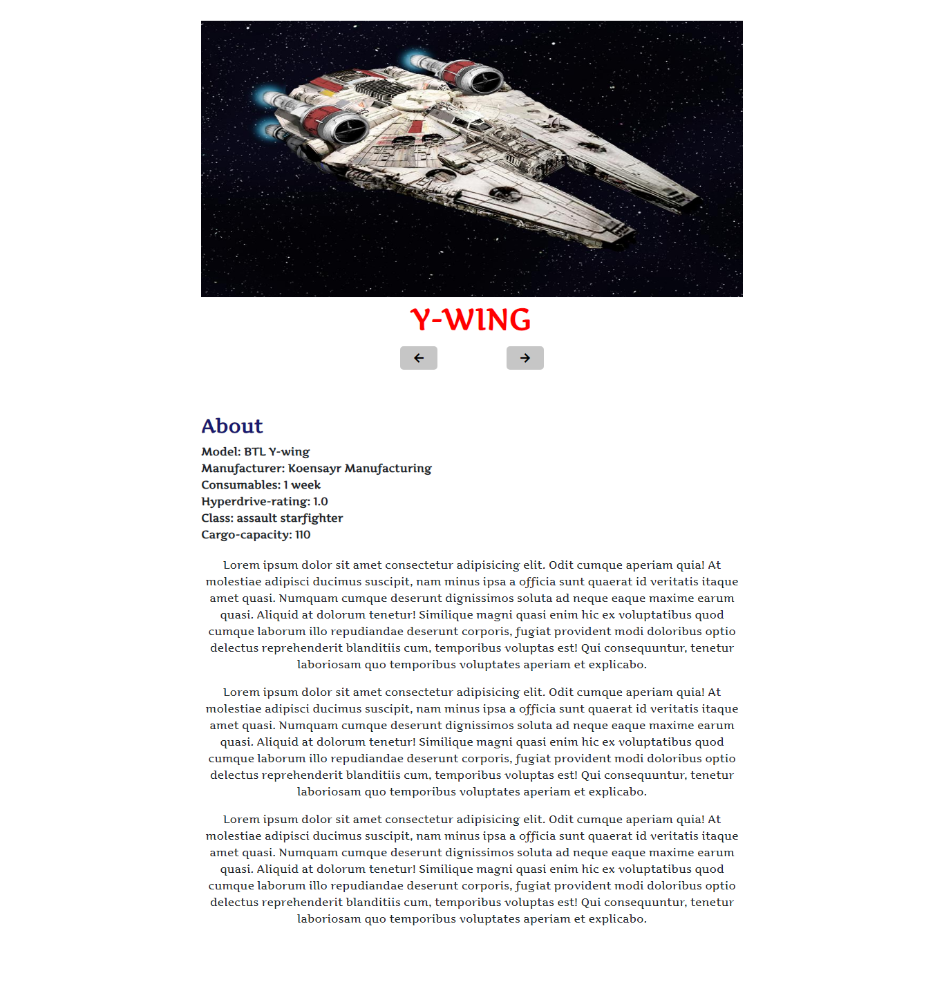
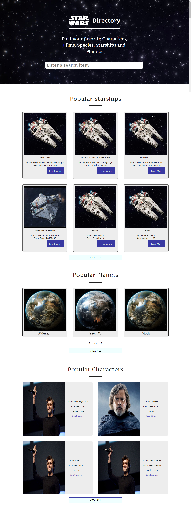
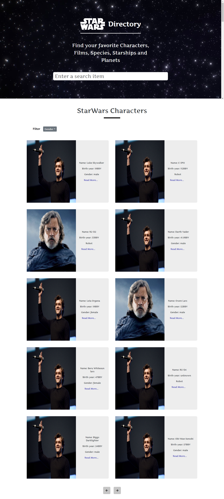
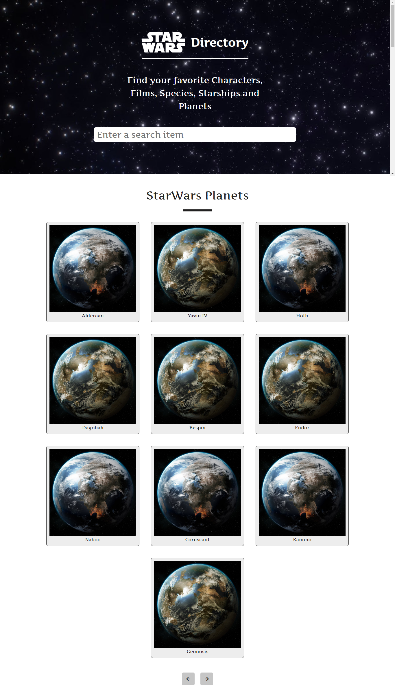
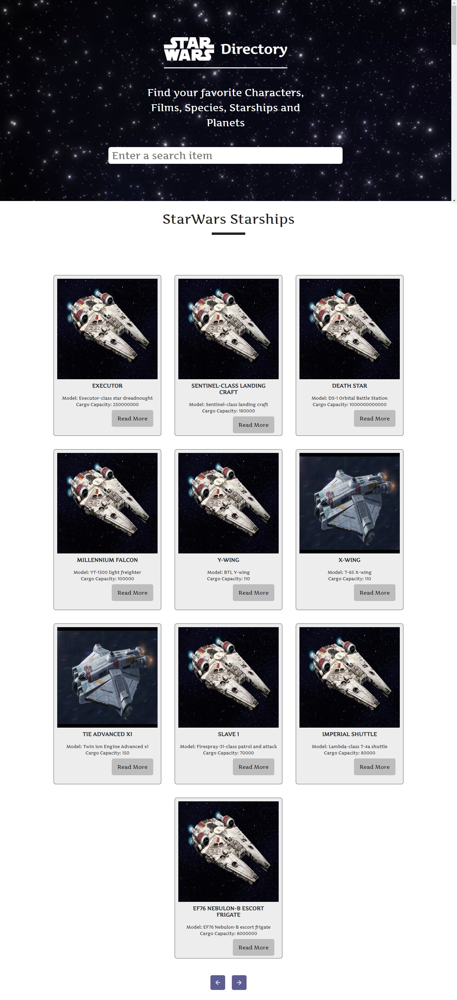

# starwars-directory
A starwars directory using the SWAPI. 

### Installation & Setup

  Clone this repository and install its dependencies.

        > git clone https://github.com/temmietope/starwars-directory

        > cd starwars-directory

        > npm install

        > npm serve

  Application is live on port 3000

        http://localhost:8080

  Or you can view online on [https://starwars-directory.netlify.com/](https://starwars-directory.netlify.com/)

### Screenshots

##### Details page

##### Home page

##### Characters page

##### Planets page
 

##### Starships page

### Repository

[https://github.com/temmietope/starwars-directory](https://github.com/temmietope/starwars-directory)
